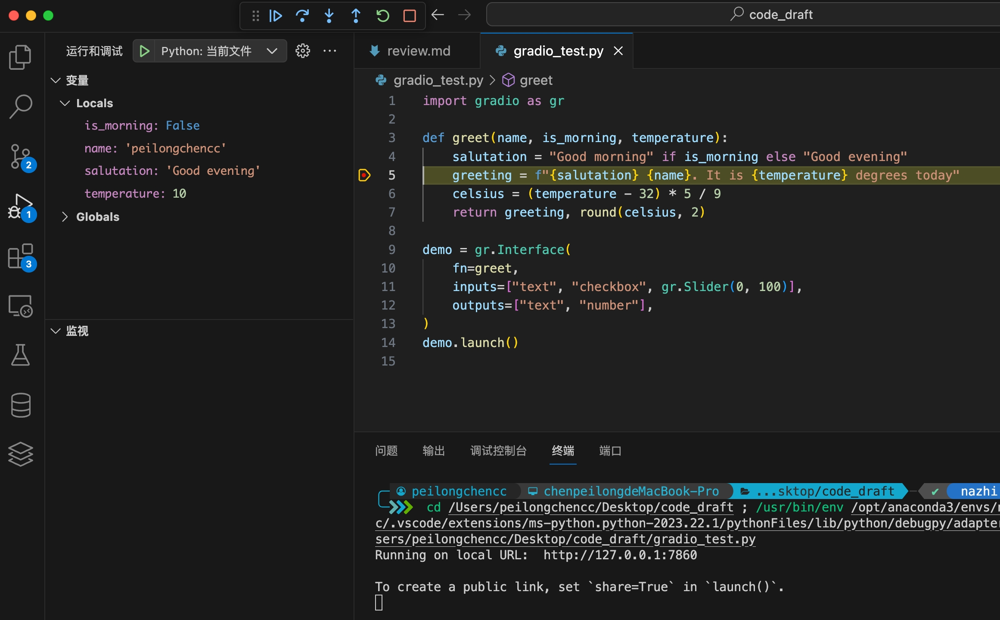
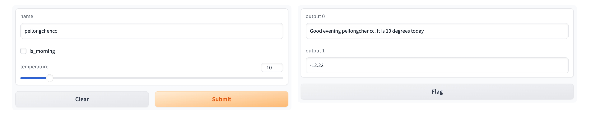

# gradio_tutorial

介绍gradio的基本使用。<br>

- [gradio\_tutorial](#gradio_tutorial)
  - [定义文本框大小:](#定义文本框大小)
  - [滑块和点击:](#滑块和点击)
  - [ChatInterface接口:](#chatinterface接口)
  - [流式输出:](#流式输出)
  - [history的使用:](#history的使用)
  - [Audio:](#audio)
    - [Description(描述):](#description描述)
    - [Behavior(行为):](#behavior行为)
  - [Real Time Speech Recognition(实时语音识别):](#real-time-speech-recognition实时语音识别)
    - [Introduction(介绍):](#introduction介绍)
    - [Prerequisites(先决条件):](#prerequisites先决条件)
      - [1. Set up the Transformers ASR Model(设置Transformers ASR模型):](#1-set-up-the-transformers-asr-model设置transformers-asr模型)
      - [2. Create a Full-Context ASR Demo with Transformers(使用Transformers创建一个完整上下文ASR演示):](#2-create-a-full-context-asr-demo-with-transformers使用transformers创建一个完整上下文asr演示)
      - [3. Create a Streaming ASR Demo with Transformers(使用Transformers创建一个流式ASR演示):](#3-create-a-streaming-asr-demo-with-transformers使用transformers创建一个流式asr演示)
      - [个人改版--每次只处理一个片段:](#个人改版--每次只处理一个片段)


## 定义文本框大小:

```python
import gradio as gr

def greet(name):
    return "Hello " + name + "!"

demo = gr.Interface(
    fn=greet,
    inputs=gr.Textbox(lines=1, placeholder="Name Here..."), # 定义文本框大小
    outputs="text",
)
demo.launch()
```

由 `lines` 的数值大小定义文本框大小。<br>


## 滑块和点击:

假设你有一个更复杂的函数，具有多个输入和输出。在下面的示例中，我定义了一个函数，它接受字符串、布尔值和数字，并返回字符串和数字。看看如何传递输入和输出组件的列表:<br>

```python
import gradio as gr

def greet(name, is_morning, temperature):
    salutation = "Good morning" if is_morning else "Good evening"
    greeting = f"{salutation} {name}. It is {temperature} degrees today"
    celsius = (temperature - 32) * 5 / 9
    return greeting, round(celsius, 2)

demo = gr.Interface(
    fn=greet,
    inputs=["text", "checkbox", gr.Slider(0, 100)], # 此处按顺序对应`greet`函数中的参数
    outputs=["text", "number"], # 返回值依旧对应的`greet`函数的返回值,依旧是按顺序对应
)
demo.launch()
```







## ChatInterface接口:

`ChatInterface`接口会自定义用户输入和整理历史数据的格式。传入的函数必须接收两个参数：`message`和`history`，且这两个参数必须按照这个顺序排列。

1. **message**: 这是一个字符串（str），代表用户的输入。

2. **history**: 这是一个列表（list of lists），代表到目前为止的对话历史。每个内部列表包含两个字符串，代表一对对话：["user_input", "assistant"]。

```python
import gradio as gr

def alternatingly_agree(message, history):
    if len(history) % 2 == 0:
        return f"Yes, I do think that '{message}'"
    else:
        return "I don't think so"

demo = gr.ChatInterface(alternatingly_agree)
demo.launch()
```

## 流式输出:

```python
import time
import gradio as gr

def string_generator(message):
    for character in message:
        yield character

def predict(message, history):
    generated = ""  # 用于存储之前生成的字符
    data = string_generator(message)
    for item in data:
        time.sleep(0.3)     # 这里设置时间用于更直观的看出流式输出,没有其他特殊含义。
        generated += item  # 将新字符添加到存储的字符串中
        yield generated  # 输出逐渐增加的字符串


demo = gr.ChatInterface(
    predict,
    chatbot=gr.Chatbot(height=500),
    textbox=gr.Textbox(placeholder="Ask me a question...", container=False, scale=7),
    title="Dragon Chatbot",
    description="Ask Dragon Chatbot any question",
    theme="soft",
    examples=["Hello", "请给我一份读取json文件的python代码", "\"consist\"的中文含义是什么？"],
    cache_examples=True,
    retry_btn=None,
    undo_btn="删除上一轮对话",
    clear_btn="清空历史数据",
).queue()
demo.launch()
```

## history的使用:

在使用`gradio`库的`ChatInterface`类时，`history`参数用于表示聊天历史。对于`gradio`的`ChatInterface`类，`history`参数是由系统自动管理的，自动从交互界面获取，数据格式为:`[[user_message, bot_message], ...]`。<br>

具体形式如下:<br>

当前的histtory为:[]<br>
当前的histtory为:[['你的名字叫什么', '您好，我没有特定的名字。我的目的是回答问题并帮助用户，您可以向我随时提出问题。']]<br>


## Audio:

```python
gradio.Audio(···)
```

### Description(描述):

Creates an audio component that can be used to **upload/record** audio (**as an input**) or display audio (as an output).<br>

创建一个音频组件，可以用于 **上传/录制音频**（**作为输入**）或显示音频（作为输出）。<br>

### Behavior(行为):

**As input component(作为输入组件):**<br>

passes audio as one of these formats (depending on type)(以以下格式之一传递音频（取决于类型）):<br>

🚀🚀🚀a str filepath, or tuple of (sample rate in Hz, audio data as numpy array).<br>

🚀🚀🚀字符串文件路径，或（采样率（以赫兹为单位），音频数据作为numpy数组）的元组。<br>

If the latter, the audio data is a 16-bit int array whose values range from -32768 to 32767 and shape of the audio data array is (samples,) for mono audio or (samples, channels) for multi-channel audio.<br>

如果是后者，则音频数据格式为 `dtype=int16`，其值范围从-32768到32767，并且音频数据数组的形状为（样本，）用于单声道音频，或（样本，通道）用于多通道音频。<br>

Your function should accept one of these types(你的函数应该接受以下类型之一):<br>

```python
def predict(
	value: str | tuple[int, np.ndarray] | None
)
	...
```

**As output component(作为输出组件):** <br>

expects audio data in any of these formats(期望以以下任一格式提供音频数据):<br>

a `str` or `pathlib.Path` filepath or `URL` to an audio file, or a bytes object (recommended for streaming), or a tuple of (sample rate in Hz, audio data as numpy array).<br>

字符串或pathlib.Path文件路径或音频文件的URL，或字节对象（推荐用于流式传输），或（以赫兹为单位的采样率，音频数据作为numpy数组）的元组。<br>

Note: if audio is supplied as a numpy array, the audio will be normalized by its peak value to avoid distortion or clipping in the resulting audio.<br>

注意：如果音频以numpy数组的形式提供，则音频将通过其峰值进行归一化，以避免结果音频中的失真或剪切。<br>

Your function should return one of these types(你的函数应该返回以下类型之一):<br>

```python
def predict(···) -> str | Path | bytes | tuple[int, np.ndarray] | None
	...	
	return value
```


## Real Time Speech Recognition(实时语音识别):

### Introduction(介绍):

Automatic speech recognition (ASR), the conversion of spoken speech to text, is a very important and thriving(非常成功;蓬勃发展) area of machine learning.<br>

自动语音识别（ASR），即将口语转换成文本，是机器学习中一个非常重要且蓬勃发展的领域。<br>

ASR algorithms run on practically(几乎;实际上) every smartphone, and are becoming increasingly embedded in professional workflows(工作流程), such as digital(数字的) assistants for nurses and doctors.<br>

ASR算法几乎运行在每一部智能手机上，并且越来越多地被嵌入到专业工作流程中，比如医生和护士的数字助手。<br>

Because ASR algorithms are designed to be used directly by customers and end users, it is important to validate(验证) that they are behaving as expected when confronted(面对;遭遇) with a wide variety of speech patterns (different accents(口音), pitches(音调), and background audio conditions).<br>

由于ASR算法是设计给客户和最终用户直接使用的，因此验证它们在面对各种各样的语音模式（不同的口音、音调和背景音频条件）时是否如预期那样运行是非常重要的。<br>

Using **gradio**, you can easily build a demo of your ASR model and share that with a testing team, or test it yourself by speaking through the microphone(麦克风) on your device.<br>

使用 **gradio** ，你可以轻松地构建一个ASR模型的演示，并与测试团队分享，或者通过设备上的麦克风亲自测试。<br>

This tutorial will show how to take a pretrained speech-to-text model and deploy it with a Gradio interface.<br>

本教程将展示如何搞一个预训练的语音转文本模型，并使用Gradio界面部署它。<br>

🚨🚨🚨We will start with **a full-context model**, in which the user speaks the entire audio before the prediction runs.<br>

🚨🚨🚨我们将从一个完整上下文模型开始，用户需要在 "预测(函数)" 运行之前 "说出整个音频"。<br>

> 意思是等音频全部输入完了，再解析？🤨🤨🤨

🔥🔥🔥Then we will adapt the demo to make it streaming, meaning that the audio model will convert speech as you speak.<br>

🔥🔥🔥然后，我们将调整演示，使其成为流式的，意味着音频模型将在你说话时转换语音。<br>

> 这部分才是重点🌈🌈🌈

### Prerequisites(先决条件):

Make sure you have the gradio Python package already installed. You will also need a pretrained speech recognition model. In this tutorial, we will build demos from 2 ASR libraries:<br>

确保你已经安装了gradio Python包。你还需要一个预训练的语音识别模型。在本教程中，我们将从2个ASR库构建演示：<br>

- Transformers (for this, `pip install transformers` and `pip install torch`)

Transformers（为此，执行 `pip install transformers` 和 `pip install torch` 命令）

Make sure you have at least one of these installed so that you can follow along the tutorial.<br>

确保你至少安装了其中一个，以便你能够跟随本教程。<br>

You will also need [**ffmpeg**](https://www.ffmpeg.org/download.html) installed on your system, if you do not already have it, to process files from the microphone.<br>

如果你的系统中还没有安装ffmpeg，你也需要安装它，以处理来自麦克风的文件。<br>

```txt
Notes:

`ffmpeg`是一个非常强大的开源工具，用于处理视频和音频文件。它支持几乎所有的视频和音频格式转换，能够录制、转码以及流化播放音视频。

`ffmpeg`可以用于视频格式转换、视频编解码、音视频合并、视频剪辑、压缩以及多种音视频处理功能。由于其功能强大且使用灵活，它被广泛应用于多媒体内容处理、数字媒体开发、视频网站和应用程序开发等领域。
```

Here’s how to build a real time speech recognition (ASR) app:<br>

以下是构建实时语音识别（ASR）应用的方法：<br>

#### 1. Set up the Transformers ASR Model(设置Transformers ASR模型):

First, you will need to have an ASR model that you have either trained yourself or you will need to download a pretrained model.<br>

首先，你需要有一个你自己训练的ASR模型，或者你需要下载一个预训练的模型。<br>

In this tutorial, we will start by using a pretrained ASR model from the model, **whisper**.<br>

在这个教程中，我们将从使用一个名为 **whisper** 的预训练ASR模型开始。<br>

Here is the code to load whisper from Hugging Face transformers:<br>

这是从Hugging Face transformers加载whisper模型的代码:<br>

```python
from transformers import pipeline

p = pipeline("automatic-speech-recognition", model="openai/whisper-base.en")
```

That’s it!<br>

就这样！<br>

#### 2. Create a Full-Context ASR Demo with Transformers(使用Transformers创建一个完整上下文ASR演示):

We will start by creating a full-context ASR demo, in which the user speaks the full audio before using the ASR model to run inference.<br>

我们将从创建一个完整上下文ASR演示开始，在此演示中，用户在使用ASR模型进行推理之前，会先说完整个音频。<br>

This is very easy with Gradio — we simply create a function around the pipeline object above.<br>

使用Gradio非常简单——我们只需围绕上述pipeline对象创建一个函数。<br>

We will use **gradio**’s built in **Audio** component(组件), configured(配置) to take input from the user’s microphone and return a filepath for the recorded audio.<br>

我们将使用gradio内置的Audio组件，配置它从用户的麦克风接收输入，并返回录制音频的文件路径。<br>

The output component will be a plain `Textbox`.<br>

输出组件将是一个简单的文本框。<br>

```python
import gradio as gr
from transformers import pipeline
import numpy as np

transcriber = pipeline("automatic-speech-recognition", model="openai/whisper-base.en")

def transcribe(audio):
    sr, y = audio
    y = y.astype(np.float32)
    y /= np.max(np.abs(y))

    return transcriber({"sampling_rate": sr, "raw": y})["text"]


demo = gr.Interface(
    transcribe,
    gr.Audio(sources=["microphone"]),
    "text",
)

demo.launch()
```

The **transcribe** function takes a single parameter `audio` which is a `numpy` array of the audio the user recorded.<br>

> transcribe: v. 记录；抄录；抄写；把…转成(另一种书写形式)；改编(乐曲，以适合其他乐器或声部)；用音标标音

`transcribe` 函数接受一个参数 `audio`，这是用户录制的音频的 `numpy` 数组。<br>

The `pipeline` object expects this in **float32** format, so we convert it first to **float32**, and then extract the transcribed text.<br>

`pipeline` 对象期望以 **float32** 格式输入，因此我们首先将其转换为 **float32**，然后提取转录文本。<br>

#### 3. Create a Streaming ASR Demo with Transformers(使用Transformers创建一个流式ASR演示):

To make this **a streaming demo**, we need to make these changes:<br>

要将这个演示变成流式的，我们需要做出以下更改：<br>

1. Set `streaming=True` in the Audio component(在 `Audio` 组件中设置 `streaming=True`)

2. Set `live=True` in the `Interface`(在 `Interface` 中设置 `live=True`)

3. Add a **state** to the interface to store the recorded audio of a user(在interface中添加一个状态state来存储用户录制的音频)

Take a look below.<br>

请看下面。<br>

```python
import gradio as gr
from transformers import pipeline  # 用于调用预训练模型的库
import numpy as np

# 加载一个预训练的自动语音识别模型
transcriber = pipeline("automatic-speech-recognition", model="openai/whisper-base.en")

# 定义一个函数，用于处理流式音频数据并进行语音转写
def transcribe(stream, new_chunk):
    # new_chunk包含采样率(sr)和音频数据(y)
    sr, y = new_chunk
    # 将音频数据的数据类型转换为np.float32
    y = y.astype(np.float32)
    # 归一化音频数据，使其振幅位于[-1, 1]
    y /= np.max(np.abs(y))

    # 如果stream非空，则将新的音频数据添加到现有的音频数据流中
    if stream is not None:
        # 将y数组加到stream数组的末尾，形成一个新的数组，并将这个新数组赋值给stream变量。这样，stream就包含了到目前为止收集到的所有音频数据。
        stream = np.concatenate([stream, y])
    else:
        # 如果stream为空，则将新的音频数据初始化为音频数据流
        stream = y
    # 返回更新后的音频数据流，以及使用语音识别模型转写的文本
    return stream, transcriber({"sampling_rate": sr, "raw": stream})["text"]

# 创建一个Gradio接口
demo = gr.Interface(
    # 指定处理函数为transcribe
    transcribe,
    # 输入为一个包含状态和音频的列表，音频输入通过麦克风获取，以流式形式传输
    ["state", gr.Audio(sources=["microphone"], streaming=True)],
    # 输出为一个包含状态和文本的列表
    ["state", "text"],
    # 设置为实时模式
    live=True,
)

# 启动应用
demo.launch()
```

🟡🟡🟡**注意:** 上述代码运行到最后，处理的是完整的音频，所以速度会很慢。对应的，可以采用每次只处理短暂片段的方式。如果每次只处理短暂片段的方式，要考虑到上下文，又可能会出现重叠问题。<br>

Notice now we have a state variable now, because we need to track(跟踪) all the audio history.<br>

现在请注意，我们有了一个状态变量，因为我们需要跟踪所有的音频历史。<br>

🔥🔥🔥`transcribe` gets **called** whenever there is a new small chunk of audio, but we also need to keep track of all the audio that has been spoken so far in state.<br>

🔥🔥🔥每当有一个新的小音频块时，`transcribe` 函数就会**被调用**，但我们也需要在状态中跟踪到目前为止已经说过的所有音频。<br>

As the interface runs, the `transcribe` function gets called, with a record of all the previously spoken audio in stream, as well as the new chunk of audio as `new_chunk`.<br>

随着 interface 的运行，`transcribe` 函数被调用，伴随着音频流中之前说过的所有音频的记录，以及作为 `new_chunk` 的新音频块。<br>

❓❓❓We return **the new full audio** so that can be stored back in state, and we also return the transcription.<br>

❓❓❓我们返回新的完整音频，以便可以将其存储回状态中，我们也返回转录文本。<br>

> 为什么返回完整音频❓

Here we naively(缺乏经验、天真或过于简单化的) append the audio together and simply call the transcriber object on the entire audio.<br>

在这里，我们天真地(也就是粗暴的)将音频连接在一起，并简单地对整个音频调用 `transcriber` 对象。<br>

⚠️⚠️⚠️You can imagine more efficient(有效的) ways of handling this, such as re-processing only the last 5 seconds of audio whenever a new chunk of audio received.<br>

⚠️⚠️⚠️你可以想象更有效的处理方式，例如每当接收到新的音频块时，只重新处理最后5秒的音频。<br>

Now the ASR model will run inference as you speak!<br>

现在，ASR模型将在你说话时进行推理！<br>

#### 个人改版--每次只处理一个片段:

由于Gradio官方Audio实时语音识别代码运行到最后，处理的是完整的音频，速度非常非常慢，个人进行了改版，每次只处理一个小片段。个人测试效果还OK。<br>

下列代码中的`transcribe`函数是否能改为异步？

```python
import gradio as gr
from transformers import pipeline
import numpy as np

print("开始加载语音模型")
# 指定模型的本地路径
model_path = "./docs/large-v3"   # 这里使用的是HF开源的"openai/whisper-large-v3"
                            # 笔者使用的 NVIDIA A100-PCIE-40GB "openai/whisper-large-v3" 运行时占用的显存位 7269MiB / 40960MiB。
transcriber = pipeline("automatic-speech-recognition", model=model_path, device="cuda")
print("语音模型加载成功🏅🏅🏅")

# 初始化一个列表来保存每个片段的转录文本
transcribed_texts = []

def transcribe(new_chunk):
    sr, y = new_chunk
    y = y.astype(np.float32)
    y /= np.max(np.abs(y))
    
    # 直接使用当前的音频片段进行转录，而不是累积音频数据
    transcribed_text = transcriber({"sampling_rate": sr, "raw": y})["text"]
    
    # 将转录出的文本添加到列表中
    transcribed_texts.append(transcribed_text)
    
    # 返回截止目前为止的转录结果
    return transcribed_texts

demo = gr.Interface(
    transcribe,
    gr.Audio(sources=["microphone"], streaming=True),
    "text",
    live=True,
)
if __name__ == "__main__":
    demo.launch(server_name="0.0.0.0", server_port=11147)
```